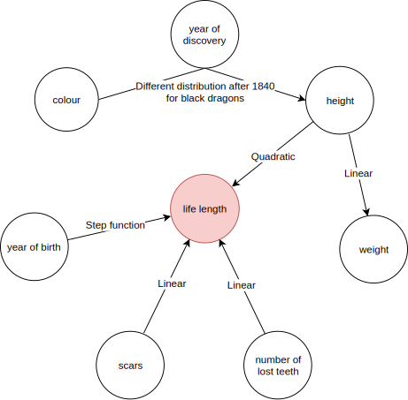

\section*{Story behind the data}

Once upon a time, there lived mighty dragons. With large teeth and strong jaws, they were a threat to all other species. Since the 18$^{\mathrm{th}}$ century archaeologists were discovering bones of those creatures. Based on their remains, they knew quite a lot about them. It was easy to measure the dragon's height and approximate weight. They also knew how many scars they'd had or how many teeth they'd lost. The remains of the scales gave information about the colour of the dragon. Based on $^{14}$C dating they could even tell when the dragon was born. But they wanted to know how long the dragon lived, which was a bit problematic. Luckily, in the old records, the date of death for several dragons could be found.

Each variable influences the target in a different way (fig. 1). Both scars and the number of lost teeth have a linear relation to the life length. The older the dragon was the more scars and fewer teeth he had. Due to heroic quests accomplished by knights, the dragons born in the middle ages lived much shorter than in other periods. As for height, the relation is more complicated. The smallest dragons were quite good at hiding themselves and therefore could live longer. Similarly, the largest dragons were difficult to kill because of their size and power. Overall the relation between height and length of life is quadratic. There is, however, one more interesting catch regarding dragons height. Around 1840 people discovered a new island and found a new breed of dragon. The exceptionally large black dragon, which lived ages because of no natural enemies. The relation stays the same, but the distribution of the height of the dragons is shifted.

Long live the dragons!

<p style="text-align:center;"><br><br>Figure 1: Diagram of relations between the variables</p>


\section*{Generating data}

The data is generated with following code:
```{r eval=FALSE}
true_model <- function(model, data){
  return(abs(500 + 100 * (abs(data$year_of_birth - 1000) > 500) +
               0.02 * (data$height - 50)^2 + 40 * data$scars + 20 * data$number_of_lost_teeth))
}

N <- 2000
set.seed(756)

year_of_birth <- round(runif(N, -2000, 1800)) # year, for negative -n = n + 1 BC
year_of_discovery <- sort(round(runif(N, 1700, 1800))) # year
height <- rgamma(N, 50) # yards
weight <- 1/4 * height + rexp(N, 1) # tons
scars <- round(rexp(N, 0.1)) # number
number_of_lost_teeth <- round(runif(N, 0, 40)) # number
colour <- sample(c('red', 'blue', 'green', 'black'), N, replace=TRUE, p=c(0.5, 0.3, 0.18, 0.02))
life_length <- true_model(NULL, data.frame(year_of_birth, height, weight,
                                           scars, colour, year_of_discovery,
                                           number_of_lost_teeth)) + rnorm(N, 0, 20)
dragons <- data.frame(year_of_birth, height, weight, scars, colour,
                 year_of_discovery, number_of_lost_teeth, life_length)

N <- 1000
set.seed(1)

year_of_birth <- round(runif(N, -2000, 2000)) # year, for negative -n = n + 1 BC
year_of_discovery <- sort(round(runif(N, 1800, 2000))) # year
colour <- sample(c('red', 'blue', 'green', 'black'), N, replace=TRUE, p=c(0.4, 0.3, 0.1, 0.2))
height <- ifelse(
  colour == 'black' & year_of_discovery > 1840,
  rgamma(N, 200),
  rgamma(N, 50)
) # yards
weight <- 1/4 * height + rexp(N, 1) # tons
scars <- round(rexp(N, 0.1)) # number
number_of_lost_teeth <- round(runif(N, 0, 40)) # number
life_length <- true_model(NULL, data.frame(year_of_birth, height, weight,
                                           scars, colour, year_of_discovery,
                                           number_of_lost_teeth)) + rnorm(N, 0, 20)
dragons_test <- data.frame(year_of_birth, height, weight, scars, colour,
                           year_of_discovery, number_of_lost_teeth, life_length)
```

Head of the data:
```{r echo=FALSE, results='hide', message=FALSE}
library("DALEX2")
```
```{r echo=FALSE}
head(dragons)
```

Example model on the data:
```{r message=FALSE}
library("randomForest")
rf_model <- randomForest(life_length ~ ., data = dragons)
rf_model
```

Explainer for the model:
```{r message=FALSE}
rf_explain <- explain(rf_model, data = dragons, 
                      y = dragons$life_length, label = "RF")
rf_explain
```
